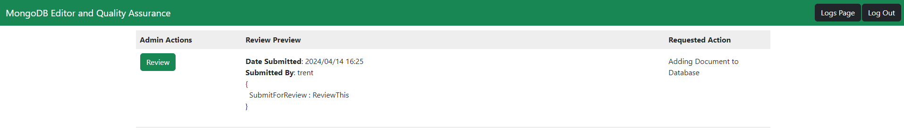
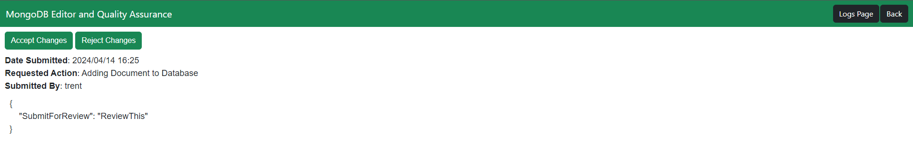
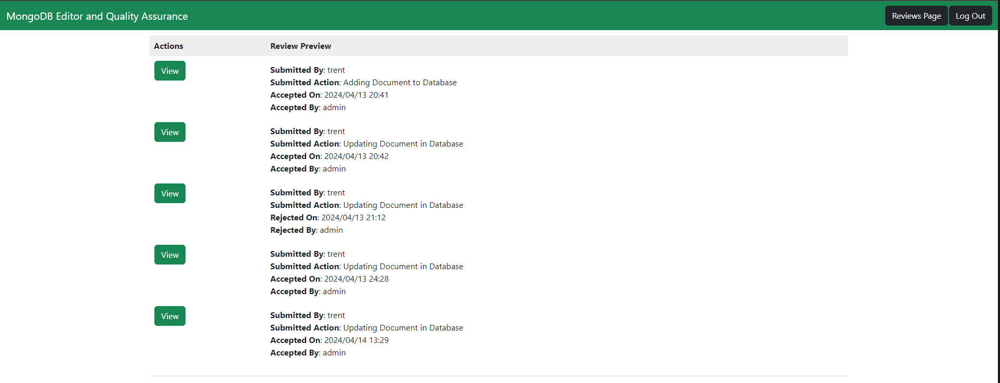
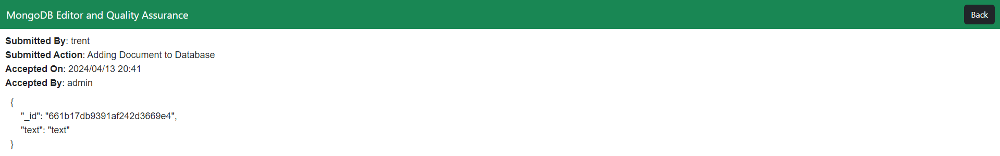

# Admin Workflow
This document aims to descibe the actions that a admin user will be able to take.

## Register Admin
If you are a new admin to the application you must first create your account. From the Login Page you can navigate to the Register User Page using the Register Link at the Bottom. 

 

The entered email must be a valid email format. To create an admin account ensure that the Admin radio button is selected. Once your information is loaded you can now hit the Register Button
## Admin Login
Now that you have an account you can login by entering your email and password and Pressing the Login Button.

 

## Review Document

Once Logged in you will be redirected to the following page:

 

This is called the All Reviews Page from here you can preview the reviews that have been submitted by users and have yet to have a verdict. To Review a document simply press the Review button in the row that holds the review you want to look at.Doing this will take you to the Review Page:

### Accepting/Rejecting Changes

From the Review Page you have a decision to either Accept or Reject the changes submitted. The Review Page will display some information to help you make your decision such as who the submission is made by and when they submitted it. The document displayed is the content that the user is submitting to the database. Pressing Accept Changes will Approve the document thus adding it to the database, the review will be removed from the All Reviews Page and a log of your action will be added to the Logs Page. Pressing Reject Changes will Reject the document, the review will be removed from the All Reviews Page and a log of your action will be added to the Logs Page.

## View Logs

In the top right corner of the All Reviews Page and Review Page is the button saying Logs Page this will take you to the Logs Page:

From this page you can take a quick glace of the recent changes to your database. If you want to see more detail of a specific log you can press the View button in the corresponding row. This will take you to the Log Page.

