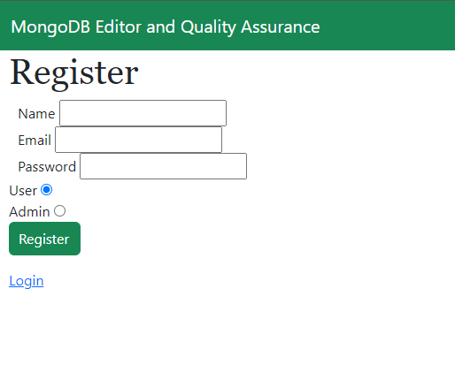
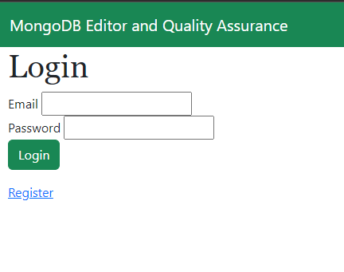
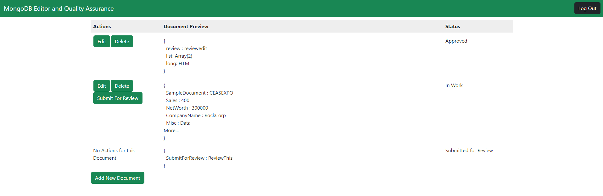
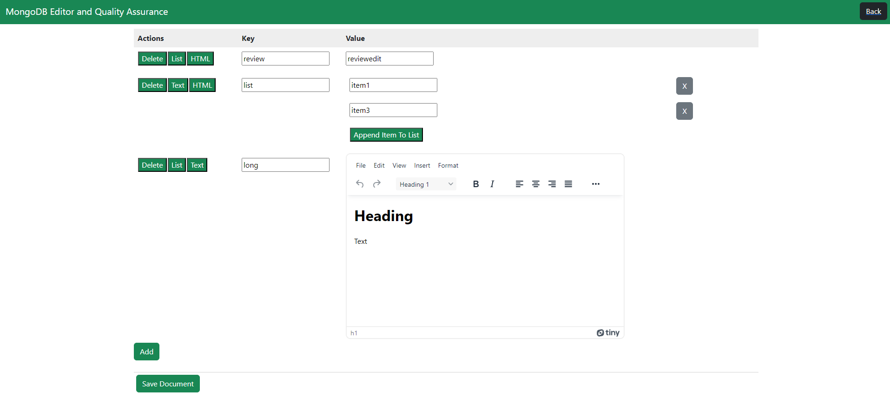

# User Workflow
This document aims to descibe the actions that a non-admin user will be able to take.

## User Registration
If you are a new user to the application you must first create your account. From the Login Page you can navigate to the Register User Page using the Register Link at the Bottom. 

 

The entered email must be a valid email format. To create a user account ensure that the User radio button is selected. Once your information is loaded you can now hit the Register Button
## User Login
Now that you have an account you can login by entering your email and password and Pressing the Login Button.

 

## Add/Edit Document

Once Logged in you will be redirected to the following page:

 

This is called the All Documents Page from here you can preview the data stored on your Database and see the current edits and changes being made. To Edit a Document press the Edit button in the same row as the document you desire to edit. To Add an entirely New Document you can press the Add New Document button at the bottom of the page. Both Editing a Document will take you to the Document Editing Page.

## Data Entry
Once you selected a document to edit you will see the Document Editor Page that will look similar to this: 

 

Using this page you can perform basic data entry into the database. This page contains a table holding the data of the document where each row represents a single key-value pair. You have three options for data entry, Simple Text, List Entry, or HTML. You can switch freely between these using the Text, List, and HTML buttons in each row. If you want to add more items to a list use the Append Item To List button for that list and to delete items from a list you can also press the Grey X button deside the item you desire to delete.

If you desire to add a key-value pair to the document you simply have to press the Add button below the table.

You can also Delete a Key-Value pair from the document by pressing the Delete button for the corresponding row.

Once the Document is edited to your hearts content simply press the Save Changes button at the bottom of the screen to Save your changes.

## Document Deletion

Now back on the All Documents Page you have the option to delete an entire document from the database. You can perform this action by pressing the Delete button in the same row as the document you want to delete. 

## Submit Document for Approval

The final Action you can take as a non-admin user is Submitting a Document for review. This will create a request for an admin to look at the changes you have made to the database and decide whether the changes should be accepted or rejected. Once a document has been submitted for review it cannot be edit or deleted until an admin gives their verdict.

### Document Status

You might have noticed the Status column on the All Documents page. There are 4 possible Statuses. In Work Status means the document currently has changes that either aren't on the database or haven't been submitted for Review. The Submitted for Review status is fairly straightforward it means that the document has been submitted for review by an admin. This status also means that you cannot edit or delete the document until an admin performs the review. The Approved/Reject Statuses mean that an admin have performed their review Approved means that the submitted changes were added to the database and Rejected means that some more work is needed before the document can be added to the database. Both of these statuses prevent you from submitting for review until you make an edit to the document in question.